# NeoUtl: Ever Optimize &mdash; Until Triumphing Liberty.

[公式サイト](https://neoutl.taisho-guy.org) / [Codeberg](https://codeberg.org/taisho-guy/NeoUtl) / [Wiki](https://codeberg.org/taisho-guy/NeoUtl/wiki/Home) / [AviQtl](https://codeberg.org/taisho-guy/NeoUtl/src/branch/aviqtl)

> [!IMPORTANT]
> 本リポジトリ（GitHub）は[Codeberg](https://codeberg.org/taisho-guy/NeoUtl)のミラーです。イシューやプルリクエスト等はCodebergにてお受けしております。

## NeoUtlとは

AviUtl ExEdit0ライクな動画編集ソフトウェアです。LinuxやWindowsで動作します。macOSも将来的にサポートする予定です。

## ロードマップ

[TODO.md](https://codeberg.org/taisho-guy/NeoUtl/src/branch/main/TODO.md)をご確認下さい。

## ダウンロード方法

[NeoUtlのお部屋](https://neoutl.taisho-guy.org)をご確認下さい。

## ビルド方法

[CONTRIBUTING.md](https://codeberg.org/taisho-guy/NeoUtl/src/branch/main/CONTRIBUTING.md)をご確認下さい。

## 採用技術

NeoUtlはRust言語で実装されています。

|項目|採用クレート|
|---|---|
|GUI|[egui](https://www.egui.rs/)|
|プレビュー|[wgpu](https://wgpu.rs)|
|シェーダ|[Slang](https://shader-slang.org/)|
|ECS|[Shipyard](https://github.com/leudz/shipyard)|
|非同期処理|[tokio](https://tokio.rs/)|
|デコード・エンコード|[FFmpeg](https://ffmpeg.org/)|

## アーキテクチャ

```mermaid
flowchart TB
    subgraph BIN["src/ — バイナリクレート NeoUtl"]
        MAIN["main.rs<br/>エントリポイント"]
        APPSTATE["app_state.rs"]
        DOC["document.rs"]
        PROJECT["project.rs"]
        SCHEMA_RS["schema.rs"]
        EXPORT["export.rs"]
        CONFIG["config.rs"]
        HOTRELOAD["hot_reload.rs"]
        SHORTCUTS["shortcuts.rs"]
        THEME["theme.rs"]
        SPLASH["splash.rs"]
        UPDATE["update.rs"]
        CRASH["crash_report.rs"]
        LOCALIZATION["localization.rs"]
        EGUILOOP["egui_loop.rs"]
        GPUSHARED["gpu_shared.rs<br/>GPUデバイス共有 / AcceleratorHandle生成"]
    end

    subgraph ECS["src/ecs/ — Entity Component System"]
        ECS_MOD["mod.rs / EcsWorld"]
        ECS_COMP["components/*<br/>hierarchy / clip_target / group_control / time_remap<br/>expression / layer_state / camera / light"]
        ECS_WORLD["world/*<br/>object_crud / hierarchy_ops / serialize / transform"]
        ECS_SYS["systems/*<br/>active_query / camera / curtain / effect_stack / expression"]
        ECS_HISTORY["history.rs<br/>Undo/Redo HistoryStack / Writeback連携"]
        ECS_PRESET["resources/preset_store.rs<br/>PresetStore / JSON永続化"]
        ECS_VIEWS["object_query_views.rs"]
        ECS_TYPES["types.rs"]
        ECS_TRANSFORM["transform.rs<br/>Camera / Light / Transform"]
        ECS_RES["resources.rs"]
        ECS_EFFECTS["effects.rs"]
        ECS_OBJSCHEMA["object_schema.rs"]
        ECS_AUDIOPLUG["audio_plugins.rs"]
    end

    subgraph LOADERS["src/objects, src/effects, src/easings — ローダー"]
        OBJ_LOADER["objects/loader.rs<br/>setup_acceleratorブロードキャスト"]
        EFFECT_LOADER["effects/loader.rs<br/>setup_acceleratorブロードキャスト / Writeback"]
        EASING_LOADER["easings/loader.rs"]
        EASING_REG["easings/registry.rs"]
    end

    subgraph RENDERER["src/renderer/ — GPUレンダリング"]
        PIPELINE["pipeline/*<br/>RenderEngine / 動的デバイス再構成・ロスト復帰"]
        EFFECT_FILTER["effect_filter.rs"]
        SLANG_SHADERS["slang/media*.slang"]
    end

    subgraph UI["src/ui/ — egui UI層"]
        UI_MOD["mod.rs"]
        UI_TIMELINE["timeline/*<br/>タイムライン編集 / Undo/Redo連携"]
        UI_PROPS["properties/*<br/>プロパティパネル / プリセット適用"]
        UI_PREVIEW["preview.rs"]
        UI_SETTINGS["system_settings.rs"]
        UI_PROJSET["project_settings.rs"]
        UI_SCENESET["scene_settings.rs"]
        UI_DIALOGS["dialogs.rs / effect_add_dialog.rs"]
        UI_CATALOG["effect_catalog.rs"]
        UI_LAUNCHER["launcher.rs"]
        UI_EXPORTDLG["export_dialog.rs"]
        UI_KEYBIND["keybindings.rs"]
    end

    subgraph AUDIO["src/audio/ — オーディオ"]
        AUDIO_MIXER["mixer.rs"]
        AUDIO_PLUGREG["plugin_registry.rs"]
        AUDIO_PLUGSET["plugin_settings.rs"]
    end

    subgraph APICRATES["crates/neoutl-*-api — 契約層"]
        MEDIA_API["neoutl-media-api"]
        OBJECT_API["neoutl-object-api<br/>Camera・Light Stable ID / setup_accelerator"]
        EFFECT_API["neoutl-effect-api<br/>ROI / Audio / Writeback / setup_accelerator"]
        EASING_API["neoutl-easing-api"]
        MLT_API["neoutl-mlt-api<br/>Filter trait"]
        SHARED_ABI["neoutl-shared-abi<br/>AcceleratorHandle / AcceleratorBackend / PluginVersion"]
        EXPRESSION_API["neoutl-expression-api<br/>数式評価 / AST / bind_expression_host"]
    end

    subgraph RUNTIME["crates/neoutl-media-runtime — デコード実行基盤"]
        MR_LOADER["loader.rs"]
        MR_WORKER["worker.rs<br/>デコードワーカー"]
        MR_CACHE["cache.rs<br/>テクスチャキャッシュ / フッテージ共有"]
        MR_RUNTIME["runtime.rs"]
        MR_TEXT["text.rs"]
        MR_WAVE["waveform.rs"]
    end

    subgraph MEDIABACK["crates/neo-media-*, media/* — デコーダ・変換実装"]
        FFMPEG_C["neo-media-ffmpeg<br/>decoder / encoder / vaapi"]
        SWSCALE["neo-media-swscale<br/>Slang/WGSLスケール変換"]
        SYMPHONIA["media/symphonia-decoder"]
        IMGDEC["media/image-decoder"]
        MEDIA_CORE["neo-media-core"]
        MEDIA_CACHE["neo-media-cache"]
        MEDIA_SUPPORT["neo-media-support"]
    end

    subgraph PLUGINHOST["crates/maolan-host-adapter — プラグインホスト"]
        MH_REGISTRY["registry.rs"]
        MH_PROCESS["process.rs"]
        MH_TYPES["types.rs"]
        MH_CRASH["crash.rs"]
        MH_BINPATH["binary_path.rs"]
    end

    subgraph OBJECTS_SO["crates/objects/* — オブジェクト .so プラグイン (9種)"]
        OBJ_VIDEO["video"]
        OBJ_AUDIO["audio"]
        OBJ_IMAGE["image"]
        OBJ_TEXT["text"]
        OBJ_SHAPE["shape"]
        OBJ_SCENE["scene"]
        OBJ_GROUP["group_control"]
        OBJ_CAMERA["camera"]
        OBJ_LIGHT["light"]
    end

    subgraph EFFECTS_SO["crates/effects/* — エフェクト .so プラグイン (23種)"]
        EFF_LIST["transform / color_correction / mosaic<br/>motion_blur / lens_blur / radial_blur<br/>directional_blur / border_blur<br/>chromatic_aberration / diffuse_light<br/>drop_shadow / clipping / diagonal_clipping<br/>mask_shape / displacement_map_*<br/>image_loop / pixel_sorter / vibration<br/>text_outline"]
    end

    subgraph SHADERBUILD["crates/neoutl-*-shader-build — Slangビルド支援"]
        EFFSHADERBUILD["neoutl-effect-shader-build"]
        OBJSHADERBUILD["neoutl-object-shader-build"]
    end

    subgraph SCRIPTLUA["crates/neoutl-lua-runtime, neoutl-effect-lua"]
        LUA_RUNTIME["neoutl-lua-runtime"]
        EFFECT_LUA["neoutl-effect-lua"]
    end

    subgraph EASINGSTD["crates/easings/neoutl-easing-standard"]
        EASING_CURVE["curve.rs"]
        EASING_SCRIPT["script.rs"]
    end

    subgraph MISC["crates/neoutl-color, neoutl-schema"]
        COLOR["neoutl-color"]
        SCHEMA_PROTO["neoutl-schema<br/>protobuf (document / export / keymap / settings)"]
    end

    subgraph XTASK["crates/xtask — ビルドツール"]
        XTASK_MAIN["main.rs"]
        XTASK_SLANG["slang.rs"]
        XTASK_DXC["dxc.rs"]
    end

    %% メイン・ドキュメント・設定
    MAIN --> APPSTATE
    MAIN --> ECS_MOD
    MAIN --> UI_MOD
    MAIN --> EGUILOOP
    APPSTATE --> DOC
    DOC --> PROJECT
    PROJECT --> SCHEMA_RS
    SCHEMA_RS --> SCHEMA_PROTO
    EXPORT --> RUNTIME
    EXPORT --> PIPELINE

    %% ECS 内部連携
    ECS_MOD --> ECS_COMP
    ECS_MOD --> ECS_WORLD
    ECS_MOD --> ECS_SYS
    ECS_MOD --> ECS_RES
    ECS_SYS --> ECS_TRANSFORM
    ECS_SYS --> ECS_EFFECTS
    ECS_SYS --> ECS_VIEWS
    ECS_EFFECTS --> EFFECT_LOADER
    ECS_OBJSCHEMA --> OBJ_LOADER
    ECS_AUDIOPLUG --> AUDIO_PLUGREG

    %% Expression連携 (Phase 6)
    ECS_COMP --> EXPRESSION_API
    ECS_SYS --> EXPRESSION_API
    EXPRESSION_API -.数式評価/値書き込み.-> ECS_COMP

    %% Undo/History & PresetStore (Phase 12, 13)
    EFFECT_LOADER -.poll_writeback.-> ECS_HISTORY
    ECS_HISTORY --> ECS_WORLD
    ECS_PRESET --> ECS_WORLD

    %% ローダー・プラグインホスト
    OBJ_LOADER --> PLUGINHOST
    EFFECT_LOADER --> PLUGINHOST
    EASING_LOADER --> EASING_REG
    EASING_REG --> EASINGSTD
    EASING_REG --> EASING_API

    %% GPU動的再設定 & アクセラレータブロードキャスト (Phase 7)
    GPUSHARED --> SHARED_ABI
    GPUSHARED -.broadcast_accelerator.-> OBJ_LOADER
    GPUSHARED -.broadcast_accelerator.-> EFFECT_LOADER
    OBJ_LOADER -.setup_accelerator.-> OBJECTS_SO
    EFFECT_LOADER -.setup_accelerator.-> EFFECTS_SO
    PIPELINE -.reconfigure / reset_device_lost.-> GPUSHARED

    %% プラグインと ABI
    PLUGINHOST --> MH_REGISTRY
    MH_REGISTRY --> OBJECTS_SO
    MH_REGISTRY --> EFFECTS_SO
    MH_PROCESS --> SHARED_ABI
    OBJECTS_SO --> OBJECT_API
    EFFECTS_SO --> EFFECT_API
    EFFECTS_SO --> SHADERBUILD
    OBJECTS_SO --> SHADERBUILD

    %% UI 接続
    UI_MOD --> UI_TIMELINE
    UI_MOD --> UI_PROPS
    UI_MOD --> UI_PREVIEW
    UI_MOD --> UI_SETTINGS
    UI_MOD --> UI_DIALOGS
    UI_TIMELINE --> ECS_MOD
    UI_TIMELINE --> ECS_HISTORY
    UI_PROPS --> ECS_EFFECTS
    UI_PROPS --> ECS_HISTORY
    UI_PROPS --> ECS_PRESET
    UI_PREVIEW --> PIPELINE
    UI_SETTINGS --> CONFIG
    UI_CATALOG --> EFFECT_LOADER

    %% レンダラー・メディアパイプライン
    PIPELINE --> SLANG_SHADERS
    PIPELINE --> GPUSHARED
    PIPELINE --> EFFECT_FILTER
    PIPELINE --> RUNTIME
    PIPELINE --> MLT_API
    ECS_SYS --> PIPELINE

    RUNTIME --> MR_LOADER
    RUNTIME --> MR_WORKER
    MR_WORKER --> MR_CACHE
    MR_LOADER --> MEDIABACK
    MR_WORKER --> MEDIABACK
    MR_TEXT --> MEDIA_API
    MR_WAVE --> MEDIA_API

    FFMPEG_C --> MEDIA_CORE
    SWSCALE --> MEDIA_CORE
    SYMPHONIA --> MEDIA_CORE
    IMGDEC --> MEDIA_CORE
    MEDIA_CORE --> MEDIA_CACHE
    MEDIA_CORE --> MEDIA_SUPPORT

    AUDIO_MIXER --> MEDIABACK
    AUDIO_PLUGREG --> PLUGINHOST

    EFFECTS_SO --> LUA_RUNTIME
    EFFECT_LUA --> LUA_RUNTIME

    XTASK_MAIN --> XTASK_SLANG
    XTASK_MAIN --> XTASK_DXC
    XTASK_MAIN -.i18n生成.-> LOCALIZATION
    XTASK_MAIN -.ビルド出力.-> OBJECTS_SO
    XTASK_MAIN -.ビルド出力.-> EFFECTS_SO
    XTASK_MAIN -.ビルド出力.-> BIN

    MEDIA_API -.契約.-> MR_LOADER
    OBJECT_API -.契約.-> OBJ_LOADER
    EFFECT_API -.契約.-> EFFECT_LOADER
    MLT_API -.契約.-> RENDERER
```

## 派生

| プロジェクト | 開発者 | 場所 | エンジン | 状況 |
| --- | --- | --- | --- | --- |
| NeoUtl | [taisho-guy](https://codeberg.org/taisho-guy) | [`main`ブランチ](https://codeberg.org/taisho-guy/NeoUtl/src/branch/main) | wgpu | ✅️ 実装中 |
| AviQtl | [taisho-guy](https://codeberg.org/taisho-guy) / [GT-610](https://codeberg.org/GT610) | [`aviqtl`ブランチ](https://codeberg.org/taisho-guy/NeoUtl/src/branch/aviqtl) | Qt Quick | ❌️ 開発終了 |
| AviQtl Plus | [GT-610](https://github.com/GT-610) | [GitHub](https://github.com/GT-610/AviQtl-Plus) | Qt Quick | ✅️ AviQtlのフォーク |

## 貢献方法

プルリクエストについては[貢献の初め方](https://codeberg.org/taisho-guy/NeoUtl/issues/53)をご覧下さい。

バグ報告、提案、議論などについては、[イシュー](https://codeberg.org/taisho-guy/NeoUtl/issues)を作成して下さい。

プルリクエスト、イシュー共に、テンプレートに従って下さい。日本語でお願い致します。

## スペシャルサンクス

| プロジェクト名 | ライセンス | 参考内容 |
| --- | --- | --- |
| [AviUtl](https://spring-fragrance.mints.ne.jp/aviutl/) | プロプライエタリ | GUI/概念の構成 |
| [NiVE3](https://www.nive.jp/) | GPLv3 | 実装設計 |

> これらのプロジェクトからはソースコード等を一切流用しておりません。

## ライセンス

This program is free software: you can redistribute it and/or modify it under the terms of the GNU Affero General Public License as published by the Free Software Foundation, either version 3 of the License, or (at your option) any later version.

This program is distributed in the hope that it will be useful, but WITHOUT ANY WARRANTY; without even the implied warranty of MERCHANTABILITY or FITNESS FOR A PARTICULAR PURPOSE. See the GNU Affero General Public License for more details.

You should have received a copy of the GNU Affero General Public License along with this program. If not, see <https://www.gnu.org/licenses/agpl.html>.
